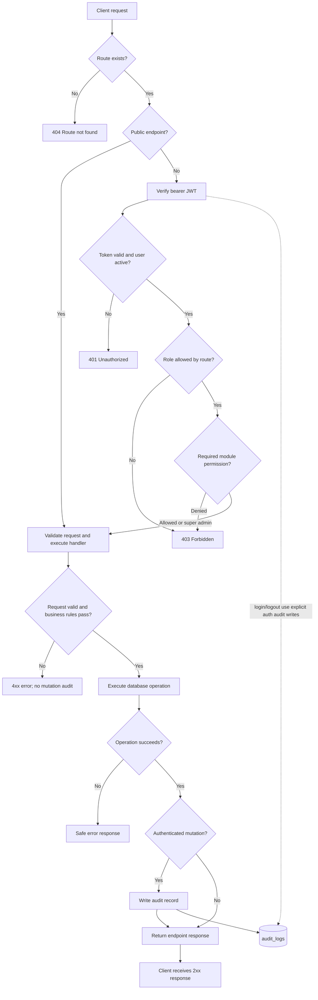

# Inventory Management API - Test Case Pack

## 1. Document scope

This is the manual/API-automation test plan for the Express API mounted under `/api`. It lists the current route handlers, access rules, endpoint-specific happy-path checks, shared negative/security checks, business workflows, and diagrams.

Routes are derived from `src/app.js` and `src/routes/*.js`; the ER model is derived from the SQL migrations in `Database Scripts/migrations`. Run destructive tests against a disposable test database, never production.

### Test conventions and setup

- Replace `{id}`, `{roleName}`, and other braced values with valid fixture values.
- Send JSON with `Content-Type: application/json` except file-upload routes, which use `multipart/form-data`.
- For protected routes, use `Authorization: Bearer <accessToken>`.
- `S_ADMIN` = active `super_admin`; `ADMIN` = active `admin`; `MANAGER` = active `manager`; `SALES` = active `sales_user`; `INVENTORY` = active `inventory_user`; `NO_PERMISSION` = authenticated user whose role lacks the route's required module/action permission.
- `USER_A` and `USER_B` are separate tenants/admin hierarchies for data-scoping tests.
- Seed valid roles, users, products, categories, units, warehouses, suppliers, customers, and inventory. Seed transactions only after their referenced entities exist.
- A “success” response means a 2xx response and a response body consistent with the endpoint contract. Verify the resulting database state and related inventory/payment/audit side effects where applicable.
- A “not found” case should use a valid UUID that does not exist; use malformed identifiers separately.
- Record actual status codes and response bodies during execution; the endpoint handlers use both 200 and 201 for successful writes.

## 2. Shared API test cases

Apply these cases to every endpoint for which the precondition is relevant; endpoint-specific positive checks are in Section 3.

| ID | Test case | Steps / expected result |
|---|---|---|
| COM-01 | Health check | `GET /api/health`; expect 200, `success: true`, running message, and ISO timestamp. No token required. |
| COM-02 | Missing authentication | Call each route marked authenticated without `Authorization`; expect 401 and no protected data/action. |
| COM-03 | Invalid/expired token | Call an authenticated route with malformed, invalid-signature, or expired JWT; expect 401. |
| COM-04 | Inactive/deleted user | Authenticate as a user who is inactive or soft-deleted; expect 401 and no handler execution. |
| COM-05 | Role restriction | Call a route with an authenticated user whose role is excluded by `authorize`; expect 403 and no mutation. |
| COM-06 | Module permission restriction | For routes using `requirePermission`, deny the required action in `module_permissions`; expect 403 and no mutation. Confirm `super_admin` bypasses module permission checks as implemented. |
| COM-07 | Invalid request body | Omit required fields or submit invalid field types/values; expect a client error and no partial write. Include empty JSON and malformed JSON where supported by the client. |
| COM-08 | Invalid identifier | Use a malformed UUID in each `:id` route; expect a controlled client/not-found response, not an unhandled 500. |
| COM-09 | Missing record | Use a well-formed UUID not present in the database; expect not found or the route's documented safe equivalent, with no unrelated record changed. |
| COM-10 | Query validation | Exercise supported pagination, search, sort, date, status, and filter parameters; confirm stable results and sensible behavior for invalid/out-of-range values. |
| COM-11 | Injection and encoding | Submit SQL metacharacters and encoded path/query values; input must be parameterized/treated as data and must not broaden access or alter schema/data. |
| COM-12 | Tenant/data scoping | As `USER_A`, list/get/update/delete only records in the permitted scope; verify `USER_B` records cannot be read or changed by guessing IDs. Repeat for admin/subordinate roles. |
| COM-13 | Method/route handling | Call an unsupported method/path; expect 404 or method-not-allowed behavior, never accidental success. |
| COM-14 | Error handling | Force a controlled DB/validation failure; expect a safe error response without stack trace, SQL text, credentials, or secret values. |
| COM-15 | Pagination consistency | For list endpoints, verify page/limit and totals (when returned), no duplicates between pages, and correct filtering before pagination. |
| COM-16 | Audit mutation coverage | For each successful authenticated write below, verify exactly one applicable audit record is created, attributed to the acting user, with normalized module/action/record ID. Verify failed writes do not create a mutation audit record and sensitive request values are omitted. Login/logout retain their explicit auth audit events. |
| COM-17 | Soft delete | For resources with `deleted_at`, delete then list/get; verify the item is hidden from normal queries and related records remain consistent. |
| COM-18 | Duplicate/conflict handling | Re-submit unique email/code/number/role name or duplicate relationship as appropriate; expect a controlled conflict/client error and no duplicate rows. |

## 3. Endpoint inventory and endpoint-specific test cases

### Health and authentication

| ID | Method and endpoint | Access | Endpoint-specific positive test and expected result |
|---|---|---|---|
| HLT-01 | `GET /api/health` | Public | See COM-01. Confirm this endpoint remains available without a database login token. |
| AUT-01 | `POST /api/auth/login` | Public | Submit valid active-user email/password; expect access and refresh tokens plus user/role data, never `password_hash`. Verify `last_login_at` and one `auth/login` audit entry. |
| AUT-02 | `POST /api/auth/logout` | Authenticated | Submit a valid token; expect successful logout and one `auth/logout` audit entry. |
| AUT-03 | `POST /api/auth/refresh-token` | Public refresh token | Submit a valid refresh token; expect a new access/refresh-token pair. Invalid, expired, or inactive-user refresh token must be rejected. |
| AUT-04 | `POST /api/auth/forgot-password` | Public | Submit a registered and an unregistered email; response should not disclose account existence. For a registered user, verify reset token hash and expiry are stored. |
| AUT-05 | `POST /api/auth/reset-password` | Public reset token | Submit a valid unexpired reset token and compliant password; verify hash changes and reset token/expiry are cleared. Reuse/expired token must fail. |
| AUT-06 | `GET /api/auth/profile` | Authenticated | Return only the current user's profile and role, with no password/reset-token fields. |
| AUT-07 | `PUT /api/auth/profile` | Authenticated; optional avatar multipart field | Update first/last name and phone; optionally upload a valid avatar. Verify only current user changes and successful mutation is audited. |
| AUT-08 | `PUT /api/auth/change-password` | Authenticated | Correct current password and valid new password succeeds; wrong current password fails; verify new password works and old password no longer does. Never expose either password. |

### Users, roles, and permissions

| ID | Method and endpoint | Access | Endpoint-specific positive test and expected result |
|---|---|---|---|
| DSH-01 | `GET /api/dashboard` | Authenticated | Return dashboard summary; verify totals match the caller's permitted scope and empty datasets are handled. |
| USR-01 | `GET /api/users/roles` | Authenticated + users:view | Return assignable roles for the current user's scope; no secret user fields. |
| USR-02 | `GET /api/users` | `super_admin`/`admin` + users:view | Return users visible to the caller with correct pagination/search and tenant scope. |
| USR-03 | `GET /api/users/{id}` | `super_admin`/`admin` + users:view | Return the selected visible user; reject out-of-scope user IDs. |
| USR-04 | `POST /api/users/admin` | `super_admin` + users:create | Create an admin with valid unique email/role and hashed password. Verify role and account state. |
| USR-05 | `POST /api/users/subordinate` | `admin` + users:create | Create subordinate linked to acting admin; verify `admin_id` and scope. |
| USR-06 | `POST /api/users` | `super_admin`/`admin` + users:create | Create permitted user; verify password hashing, role assignment and ownership. |
| USR-07 | `PUT /api/users/{id}` | `super_admin`/`admin` + users:edit | Update allowed profile/role/status fields; verify caller cannot edit out-of-scope user or escalate role beyond policy. |
| USR-08 | `DELETE /api/users/{id}` | `super_admin`/`admin` + users:delete | Delete/deactivate permitted user per implementation; verify subsequent authentication is denied and audit entry is written. |
| ROL-01 | `GET /api/roles` | `super_admin`/`admin` + roles:view | Return in-scope roles with pagination/search. |
| ROL-02 | `GET /api/roles/{id}` | `super_admin`/`admin` + roles:view | Return role including the full normalized module-permission map; verify all selected permissions match stored `module_permissions`. |
| ROL-03 | `POST /api/roles` | `super_admin` + roles:create | Create unique role with description and selected permission flags; verify saved permission values are returned and persisted. |
| ROL-04 | `PUT /api/roles/{id}` | `super_admin` + roles:edit | Update name/description and mixed true/false permission values; re-fetch and confirm selected flags are checked-equivalent/persisted, while omitted modules/actions normalize to false. |
| ROL-05 | `DELETE /api/roles/{id}` | `super_admin` + roles:delete | Delete an unused role; verify assigned-user/foreign-key conflict is safely handled and the role is no longer returned. |
| PER-01 | `GET /api/permissions/my-permissions` | Authenticated | Return current role's module permissions; verify role-specific values and no other role's data. |
| PER-02 | `GET /api/permissions` | `super_admin`/`admin` | Return permission map; confirm access denied to other roles. |
| PER-03 | `PUT /api/permissions/{roleName}/{module}` | `super_admin`/`admin` | Update one module's view/create/edit/delete flags; verify only the addressed role/module changes and RBAC takes effect on the next protected request. |

### Product catalog and reference data

| ID | Method and endpoint | Access | Endpoint-specific positive test and expected result |
|---|---|---|---|
| PRD-01 | `GET /api/products/import-sample` | `super_admin`/`admin`/`manager` + products:view | Download a valid sample import file with expected headers/content type. |
| PRD-02 | `GET /api/products/export` | Authenticated + products:view | Export filtered product data; verify requested filters and exported values match visible records. |
| PRD-03 | `GET /api/products` | Authenticated + products:view | Return product list with pagination/search/category filters and permitted scope. |
| PRD-04 | `GET /api/products/{id}` | Authenticated + products:view | Return product details and related category/unit/inventory data as available. |
| PRD-05 | `POST /api/products` | `super_admin`/`admin`/`manager` + products:create; optional image | Create product with valid price/tax/unit/category fields and optional image; verify unique code, defaults, and response. |
| PRD-06 | `PUT /api/products/{id}` | `super_admin`/`admin`/`manager` + products:edit; optional image | Update product fields and optional image; verify persisted values and unchanged fields. |
| PRD-07 | `DELETE /api/products/{id}` | `super_admin`/`admin` + products:delete | Delete/soft-delete product; verify hidden from normal list and referenced historical transactions remain valid. |
| PRD-08 | `POST /api/products/bulk-import` | `super_admin`/`admin`/`manager` + products:create; multipart file | Upload a valid import file; verify successful rows, row-level errors, duplicate handling, and import summary. |
| CAT-01 | `GET /api/categories` | Authenticated + categories:view | Return categories; verify parent/child fields and pagination/search if supported. |
| CAT-02 | `GET /api/categories/{id}` | Authenticated + categories:view | Return requested category and expected hierarchy information. |
| CAT-03 | `POST /api/categories` | `super_admin`/`admin`/`manager` + categories:create | Create category with unique code and optional parent; verify returned record. |
| CAT-04 | `PUT /api/categories/{id}` | `super_admin`/`admin`/`manager` + categories:edit | Update category fields and parent; reject invalid/self-referential hierarchy if prohibited. |
| CAT-05 | `DELETE /api/categories/{id}` | `super_admin`/`admin` + categories:delete | Delete/soft-delete unused category; verify products/references do not become inconsistent. |
| SUP-01 | `GET /api/suppliers` | Authenticated + suppliers:view | Return visible suppliers with supported search/pagination. |
| SUP-02 | `GET /api/suppliers/{id}` | Authenticated + suppliers:view | Return supplier details. |
| SUP-03 | `POST /api/suppliers` | `super_admin`/`admin`/`manager` + suppliers:create | Create supplier with unique code and valid contact/financial fields. |
| SUP-04 | `PUT /api/suppliers/{id}` | `super_admin`/`admin`/`manager` + suppliers:edit | Update supplier; verify no unrelated supplier fields change. |
| SUP-05 | `DELETE /api/suppliers/{id}` | `super_admin`/`admin` + suppliers:delete | Delete/soft-delete eligible supplier; verify referenced purchase history is retained. |
| CUS-01 | `GET /api/customers` | Authenticated + customers:view | Return visible customers with supported search/pagination. |
| CUS-02 | `GET /api/customers/{id}` | Authenticated + customers:view | Return customer details. |
| CUS-03 | `POST /api/customers` | `super_admin`/`admin`/`manager`/`sales_user` + customers:create | Create customer with valid unique code/contact/credit fields. |
| CUS-04 | `PUT /api/customers/{id}` | `super_admin`/`admin`/`manager`/`sales_user` + customers:edit | Update customer fields; verify scope and persisted values. |
| CUS-05 | `DELETE /api/customers/{id}` | `super_admin`/`admin` + customers:delete | Delete/soft-delete eligible customer; verify historical sale references remain intact. |
| WH-01 | `GET /api/warehouses` | Authenticated + warehouses:view | Return visible warehouses with pagination/filtering if supported. |
| WH-02 | `GET /api/warehouses/{id}/inventory` | Authenticated + warehouses:view | Return only stock for the selected warehouse, including product and available quantity. |
| WH-03 | `GET /api/warehouses/{id}` | Authenticated + warehouses:view | Return requested warehouse. |
| WH-04 | `POST /api/warehouses` | `super_admin`/`admin` + warehouses:create | Create warehouse with unique code and valid address/contact values. |
| WH-05 | `PUT /api/warehouses/{id}` | `super_admin`/`admin` + warehouses:edit | Update warehouse; verify inventory is unaffected by descriptive field updates. |
| WH-06 | `DELETE /api/warehouses/{id}` | `super_admin` + warehouses:delete | Delete/soft-delete only when allowed; verify warehouse with stock/history is safely protected. |
| UNT-01 | `GET /api/units` | Authenticated | Return seeded units sorted by name; no mutation occurs. |

### Inventory, purchasing, and payments

| ID | Method and endpoint | Access | Endpoint-specific positive test and expected result |
|---|---|---|---|
| INV-01 | `GET /api/inventory` | Authenticated + inventory:view | Return inventory by product/warehouse with correct available stock calculation. |
| INV-02 | `GET /api/inventory/transactions` | Authenticated + inventory:view | Return transaction history with correct before/after quantities and supported filters/pagination. |
| INV-03 | `POST /api/inventory/stock-in` | `super_admin`/`admin`/`manager`/`inventory_user` + inventory:create | Add positive quantity to a valid product/warehouse; verify stock and `stock_in` transaction update together. |
| INV-04 | `POST /api/inventory/stock-out` | `super_admin`/`admin`/`manager`/`inventory_user` + inventory:create | Remove available quantity; verify insufficient stock is rejected and no negative/partial update occurs. |
| INV-05 | `POST /api/inventory/adjustment` | `super_admin`/`admin`/`manager` + inventory:edit | Apply valid positive/negative adjustment with reason; verify stock and adjustment transaction. |
| INV-06 | `POST /api/inventory/transfer` | `super_admin`/`admin`/`manager` + inventory:edit | Transfer stock between distinct valid warehouses; verify source/destination balances and paired transaction records. |
| PUR-01 | `GET /api/purchases` | Authenticated + purchases:view | Return visible purchases with filters/pagination. |
| PUR-02 | `GET /api/purchases/{id}/pdf` | Authenticated + purchases:view | Download a readable purchase PDF for an existing visible purchase; unknown/out-of-scope purchase is rejected. |
| PUR-03 | `GET /api/purchases/{id}` | Authenticated + purchases:view | Return purchase, items, supplier/warehouse, totals, and payment summary. |
| PUR-04 | `POST /api/purchases` | `super_admin`/`admin`/`manager` + purchases:create | Create purchase with valid supplier, warehouse, item quantities/prices; verify totals, item rows, and expected receipt/inventory behavior. |
| PUR-05 | `PATCH /api/purchases/{id}/status` | `super_admin`/`admin`/`manager` + purchases:edit | Move purchase through allowed status transition; verify illegal transition and invalid status are rejected. |
| PUR-06 | `DELETE /api/purchases/{id}` | `super_admin`/`admin` + purchases:delete | Delete/soft-delete eligible purchase; preserve associated accounting/inventory history as required. |
| PPY-01 | `GET /api/purchases/{id}/payment-history` | Authenticated + purchases:view | Return payment history belonging only to requested purchase, ordered consistently. |
| PPY-02 | `PATCH /api/purchases/{id}/payment` | `super_admin`/`admin`/`manager` + purchases:edit | Record valid partial/full payment; verify payment row, paid amount, and payment status update atomically. Reject overpayment/invalid amount if not allowed by business rules. |
| PRE-01 | `GET /api/purchase-returns` | Authenticated + purchase_returns:view | Return visible purchase returns with supported filters/pagination. |
| PRE-02 | `GET /api/purchase-returns/{id}` | Authenticated + purchase_returns:view | Return return header and item details for an existing record. |
| PRE-03 | `POST /api/purchase-returns` | `super_admin`/`admin`/`manager` + purchase_returns:create | Create return against valid purchase/supplier/warehouse and returnable item quantities; verify totals and stock effect per status/business rule. |
| PRE-04 | `PATCH /api/purchase-returns/{id}/status` | `super_admin`/`admin`/`manager` + purchase_returns:edit | Transition through allowed return states; verify inventory/accounting side effects once only. |
| PRE-05 | `DELETE /api/purchase-returns/{id}` | `super_admin`/`admin` + purchase_returns:delete | Delete/soft-delete eligible return and verify history/stock integrity. |

### Sales, returns, and reports

| ID | Method and endpoint | Access | Endpoint-specific positive test and expected result |
|---|---|---|---|
| SAL-01 | `GET /api/sales` | Authenticated + sales:view | Return visible sales with search/date/status/pagination filters. |
| SAL-02 | `GET /api/sales/last-price` | `super_admin`/`admin`/`manager`/`sales_user` + sales:view | Return the last price for valid product/customer query inputs; unknown combination returns safe empty/not-found result. |
| SAL-03 | `GET /api/sales/{id}/pdf` | Authenticated + sales:view | Download valid sale PDF with expected totals/items/customer details. |
| SAL-04 | `GET /api/sales/{id}/payment-history` | `super_admin`/`admin`/`manager`/`sales_user` + sales:view | Return only requested sale's payment history. |
| SAL-05 | `GET /api/sales/{id}` | Authenticated + sales:view | Return sale header, items, customer/warehouse, totals and payment summary. |
| SAL-06 | `POST /api/sales` | `super_admin`/`admin`/`manager`/`sales_user` + sales:create | Create sale with valid items; verify totals, stock deduction, sale items, and payment defaults/initial payment behavior. Insufficient stock must not leave partial records. |
| SAL-07 | `PATCH /api/sales/{id}/payment` | `super_admin`/`admin`/`manager`/`sales_user` + sales:edit | Record payment; verify payment history, paid amount, and unpaid/partial/paid state are consistent. |
| SAL-08 | `PATCH /api/sales/{id}/status` | `super_admin`/`admin`/`manager`/`sales_user` + sales:edit | Apply allowed transition; verify delivery/cancel effects and reject invalid transitions. |
| SAL-09 | `DELETE /api/sales/{id}` | `super_admin`/`admin` + sales:delete | Delete/soft-delete eligible sale; verify stock/payment history follows configured deletion rules and audit event is recorded. |
| SRE-01 | `GET /api/sale-returns` | Authenticated + sale_returns:view | Return visible sale returns with filters/pagination. |
| SRE-02 | `GET /api/sale-returns/{id}` | Authenticated + sale_returns:view | Return return header and item details. |
| SRE-03 | `POST /api/sale-returns` | `super_admin`/`admin`/`manager`/`sales_user` + sale_returns:create | Create a return for a valid sale and returnable quantities; verify totals and stock/accounting side effects. |
| SRE-04 | `PATCH /api/sale-returns/{id}/status` | `super_admin`/`admin`/`manager` + sale_returns:edit | Transition through allowed status; ensure completed/cancelled side effects are applied once. |
| SRE-05 | `DELETE /api/sale-returns/{id}` | `super_admin`/`admin` + sale_returns:delete | Delete/soft-delete eligible return without corrupting sale/inventory history. |
| REP-01 | `GET /api/reports/inventory` | Authenticated + reports:view | Verify report quantities match inventory tables for selected filters/date range. |
| REP-02 | `GET /api/reports/purchases` | Authenticated + reports:view | Verify purchase report totals, statuses, and date filters against fixture purchases. |
| REP-03 | `GET /api/reports/sales` | Authenticated + reports:view | Verify sales report totals, statuses, and date filters against fixture sales. |
| REP-04 | `GET /api/reports/profit-loss` | Authenticated + reports:view | Verify income/cost/tax/discount calculations against controlled purchase/sale fixtures and date filters. |

### Notifications and audit logs

| ID | Method and endpoint | Access | Endpoint-specific positive test and expected result |
|---|---|---|---|
| NOT-01 | `GET /api/notifications` | Authenticated + notifications:view | Return only notifications visible to the caller, with correct read state and pagination if supported. |
| NOT-02 | `POST /api/notifications/check-stock` | Authenticated + notifications:create | Run low-stock check; verify notifications are created for qualifying products and repeated checks do not create unintended duplicates. |
| NOT-03 | `PATCH /api/notifications/mark-all-read` | Authenticated + notifications:edit | Mark only the caller's eligible notifications as read; other users' notifications remain unchanged. |
| NOT-04 | `PATCH /api/notifications/{id}/read` | Authenticated + notifications:edit | Mark one visible notification as read; unknown/out-of-scope ID is rejected. |
| AUD-01 | `GET /api/audit-logs` | Authenticated; `super_admin`/`admin` + audit_logs:view | Return paginated audit entries; independently verify `user_id`, `action`, `module`, `from_date`, and `to_date` filters. Confirm actor identity is joined and password/token values are absent. |

## 4. End-to-end business workflows

| ID | Workflow | Steps and checkpoints |
|---|---|---|
| E2E-01 | User authentication and RBAC | Create/seed role permissions → create active user with role → login → call allowed endpoint → call denied endpoint → change permission → retry → logout. Verify token, access decisions, and auth audit rows. |
| E2E-02 | Product and stock setup | Create category/unit/warehouse/product → stock-in → read inventory and transactions → stock-out/adjustment → verify on-hand and available quantities. |
| E2E-03 | Purchase and payment | Create supplier → create purchase with items → update status/receive → record partial payment → record remaining payment → inspect purchase, payment history, inventory, reports, and audit log. |
| E2E-04 | Sale and payment | Create customer and stock → create sale → verify stock deduction → record partial/full payments → inspect sale/PDF/payment history/reports → verify audit log. |
| E2E-05 | Returns and stock reconciliation | Create completed purchase/sale → create return with bounded item quantity → transition return status → verify inventory and return totals → ensure duplicate status change cannot apply stock twice. |
| E2E-06 | Tenant isolation | Create two admin hierarchies with separate records → access each list and direct-ID route under each hierarchy → verify no cross-tenant read/update/delete. |
| E2E-07 | Audit trail | Perform successful create/update/delete and business actions as distinct users → query audit logs by user/action/module/date → verify actor, module, record ID, request values, IP/user agent, no secrets, and no event for failed writes. |
| E2E-08 | File handling | Upload valid/invalid product image, avatar, and bulk-import file → verify size/type handling, stored URL/file behavior, parser errors, and no path traversal or executable upload. |

## 5. API request flowchart

## 6. ER diagram

The diagram lists application tables and their principal foreign-key relationships. `module_permissions` is keyed logically by `(role_name, module)` and currently stores a role name rather than a foreign key to `roles`.

```mermaid
erDiagram
    ROLES {
        uuid id PK
        varchar name UK
        text description
        uuid created_by FK
        timestamptz created_at
        timestamptz updated_at
    }
    PERMISSIONS {
        uuid id PK
        varchar module
        varchar action
    }
    ROLE_PERMISSIONS {
        uuid id PK
        uuid role_id FK
        uuid permission_id FK
    }
    MODULE_PERMISSIONS {
        uuid id PK
        text role_name
        text module
        boolean can_view
        boolean can_create
        boolean can_edit
        boolean can_delete
    }
    USERS {
        uuid id PK
        varchar email UK
        varchar password_hash
        uuid role_id FK
        uuid admin_id FK
        boolean is_active
        timestamptz deleted_at
    }
    WAREHOUSES {
        uuid id PK
        varchar code UK
        varchar name
        uuid created_by FK
    }
    CATEGORIES {
        uuid id PK
        varchar code UK
        varchar name
        uuid parent_id FK
        uuid created_by FK
    }
    UNITS {
        uuid id PK
        varchar name
        varchar abbreviation
    }
    SUPPLIERS {
        uuid id PK
        varchar code UK
        varchar name
        uuid created_by FK
    }
    CUSTOMERS {
        uuid id PK
        varchar code UK
        varchar name
        uuid created_by FK
    }
    PRODUCTS {
        uuid id PK
        varchar code UK
        varchar name
        uuid category_id FK
        uuid unit_id FK
        uuid created_by FK
    }
    INVENTORY {
        uuid id PK
        uuid product_id FK
        uuid warehouse_id FK
        decimal current_stock
        decimal reserved_stock
        decimal damaged_stock
    }
    INVENTORY_TRANSACTIONS {
        uuid id PK
        uuid product_id FK
        uuid warehouse_id FK
        uuid created_by FK
        varchar transaction_type
        decimal quantity
    }
    STOCK_TRANSFERS {
        uuid id PK
        varchar transfer_number UK
        uuid from_warehouse_id FK
        uuid to_warehouse_id FK
        uuid created_by FK
    }
    STOCK_TRANSFER_ITEMS {
        uuid id PK
        uuid transfer_id FK
        uuid product_id FK
        decimal quantity
    }
    PURCHASES {
        uuid id PK
        varchar purchase_number UK
        uuid supplier_id FK
        uuid warehouse_id FK
        uuid created_by FK
    }
    PURCHASE_ITEMS {
        uuid id PK
        uuid purchase_id FK
        uuid product_id FK
        decimal quantity
    }
    PURCHASE_PAYMENTS {
        uuid id PK
        uuid purchase_id FK
        uuid created_by FK
        decimal amount
    }
    PURCHASE_RETURNS {
        uuid id PK
        varchar return_number UK
        uuid purchase_id FK
        uuid supplier_id FK
        uuid warehouse_id FK
        uuid created_by FK
    }
    PURCHASE_RETURN_ITEMS {
        uuid id PK
        uuid return_id FK
        uuid product_id FK
        decimal quantity
    }
    SALES {
        uuid id PK
        varchar sale_number UK
        uuid customer_id FK
        uuid warehouse_id FK
        uuid created_by FK
    }
    SALE_ITEMS {
        uuid id PK
        uuid sale_id FK
        uuid product_id FK
        decimal quantity
    }
    SALE_PAYMENTS {
        uuid id PK
        uuid sale_id FK
        uuid created_by FK
        decimal amount
    }
    SALE_RETURNS {
        uuid id PK
        varchar return_number UK
        uuid sale_id FK
        uuid customer_id FK
        uuid warehouse_id FK
        uuid created_by FK
    }
    SALE_RETURN_ITEMS {
        uuid id PK
        uuid return_id FK
        uuid product_id FK
        decimal quantity
    }
    NOTIFICATIONS {
        uuid id PK
        uuid user_id FK
        varchar type
        boolean is_read
        uuid reference_id
    }
    AUDIT_LOGS {
        uuid id PK
        uuid user_id FK
        varchar action
        varchar module
        uuid record_id
        jsonb old_values
        jsonb new_values
    }

    ROLES ||--o{ USERS : assigns
    USERS ||--o{ USERS : administers
    USERS ||--o{ ROLES : creates
    ROLES ||--o{ ROLE_PERMISSIONS : grants
    PERMISSIONS ||--o{ ROLE_PERMISSIONS : included_in
    CATEGORIES ||--o{ CATEGORIES : parent_of
    CATEGORIES ||--o{ PRODUCTS : categorizes
    UNITS ||--o{ PRODUCTS : measures
    PRODUCTS ||--o{ INVENTORY : stocked_as
    WAREHOUSES ||--o{ INVENTORY : stores
    PRODUCTS ||--o{ INVENTORY_TRANSACTIONS : moves
    WAREHOUSES ||--o{ INVENTORY_TRANSACTIONS : records_at
    WAREHOUSES ||--o{ STOCK_TRANSFERS : source
    WAREHOUSES ||--o{ STOCK_TRANSFERS : destination
    STOCK_TRANSFERS ||--o{ STOCK_TRANSFER_ITEMS : contains
    PRODUCTS ||--o{ STOCK_TRANSFER_ITEMS : transferred
    SUPPLIERS ||--o{ PURCHASES : supplies
    WAREHOUSES ||--o{ PURCHASES : receives_at
    PURCHASES ||--o{ PURCHASE_ITEMS : contains
    PRODUCTS ||--o{ PURCHASE_ITEMS : purchased
    PURCHASES ||--o{ PURCHASE_PAYMENTS : paid_by
    PURCHASES ||--o{ PURCHASE_RETURNS : returned_from
    PURCHASE_RETURNS ||--o{ PURCHASE_RETURN_ITEMS : contains
    PRODUCTS ||--o{ PURCHASE_RETURN_ITEMS : returned
    CUSTOMERS ||--o{ SALES : places
    WAREHOUSES ||--o{ SALES : fulfilled_from
    SALES ||--o{ SALE_ITEMS : contains
    PRODUCTS ||--o{ SALE_ITEMS : sold
    SALES ||--o{ SALE_PAYMENTS : paid_by
    SALES ||--o{ SALE_RETURNS : returned_from
    SALE_RETURNS ||--o{ SALE_RETURN_ITEMS : contains
    PRODUCTS ||--o{ SALE_RETURN_ITEMS : returned
    USERS ||--o{ NOTIFICATIONS : receives
    USERS ||--o{ AUDIT_LOGS : performs
    USERS ||--o{ INVENTORY_TRANSACTIONS : records
    USERS ||--o{ PURCHASES : creates
    USERS ||--o{ SALES : creates
    USERS ||--o{ PURCHASE_PAYMENTS : records
    USERS ||--o{ SALE_PAYMENTS : records
```

## 7. Test execution record

| Run date | Environment/build | Tester | Passed | Failed | Blocked | Defects/notes |
|---|---|---|---:|---:|---:|---|
|  |  |  |  |  |  |  |
